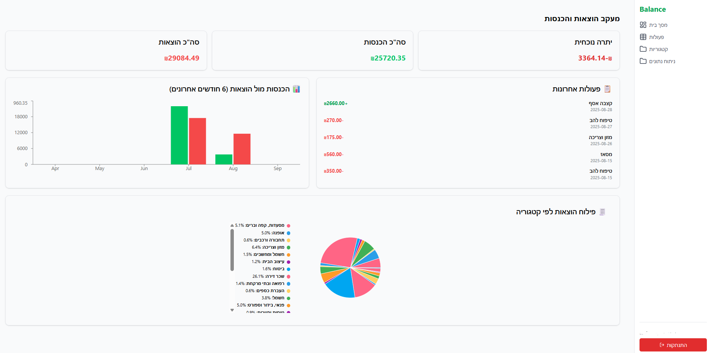
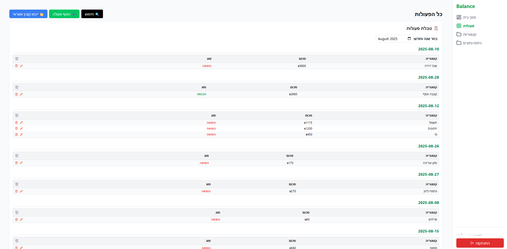
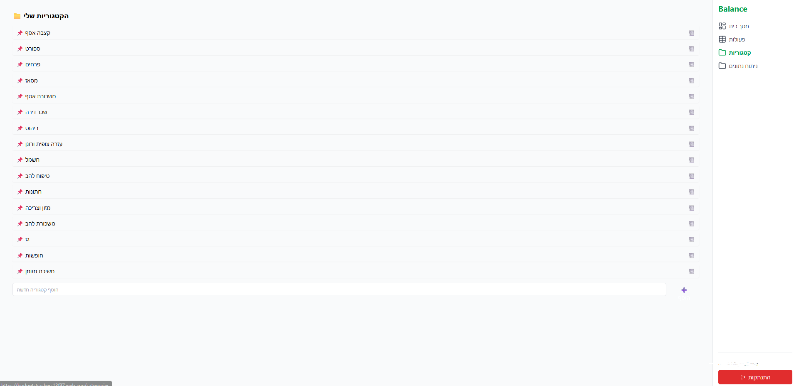
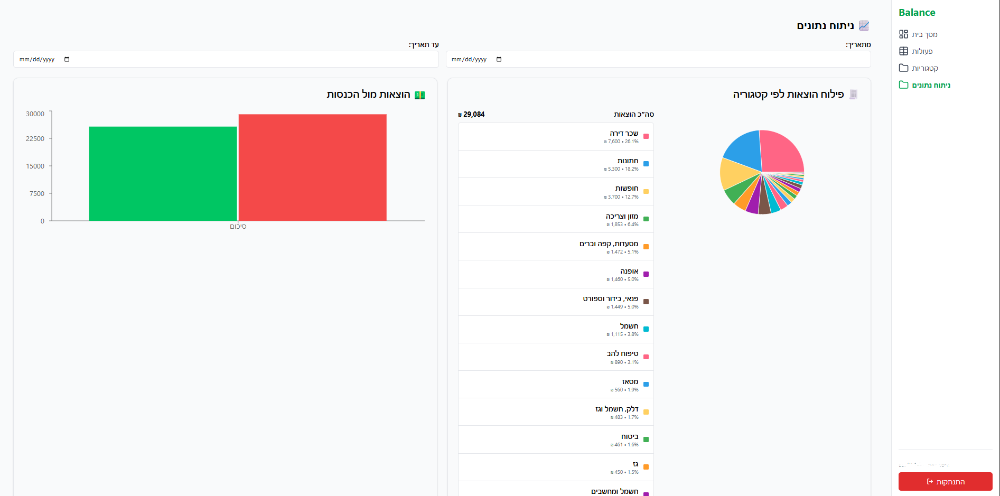

# 💰 Budget Tracker

A personal finance tracker for managing expenses and income with **credit card import**, **visual analytics**, and **smart saving suggestions**.  
Built with **React + Firebase**.

---

## ✨ Features
- 📂 **Credit Card Import (Isracard / Max)** – automatically converts Excel statements into monthly transactions.
- ➕ **Manual Transactions** – add custom expenses or income.
- 📊 **Charts & Reports**:
  - Bar chart: income vs. expenses (last 6 months).
  - Pie chart: expense breakdown by category.
- 💡 **Smart Saving Suggestions (local AI)** – automatic cost-saving recommendations.
- 🔎 **Search & Filter** by date and category.
- 🔐 **User Authentication** via Firebase Auth.

---

## 🖼️ Screenshots

### Dashboard

### Transactions (Actions Page)

### Categories Page

### Analytics Page

---

